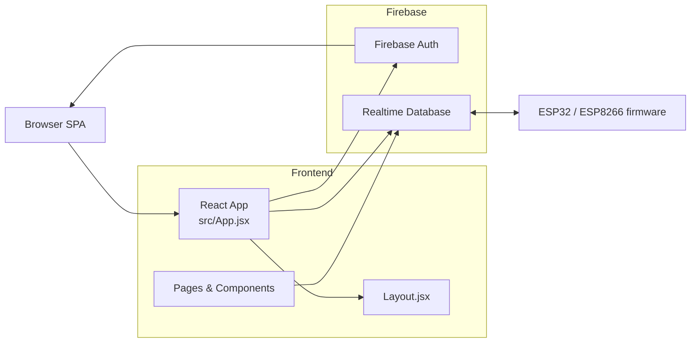
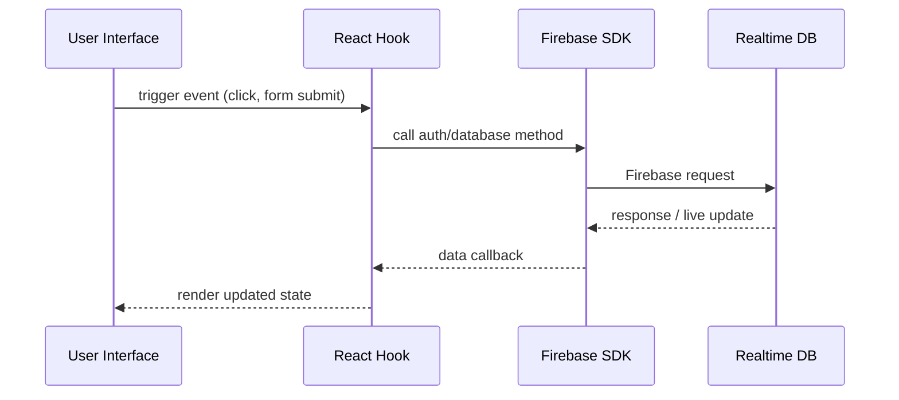
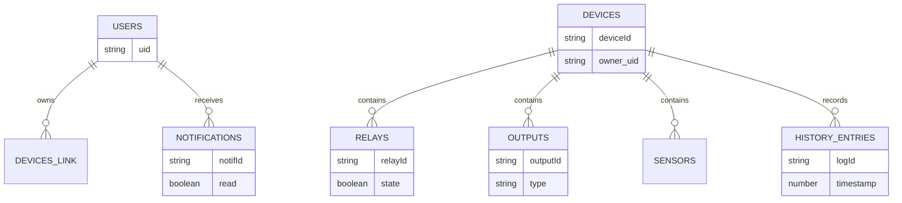
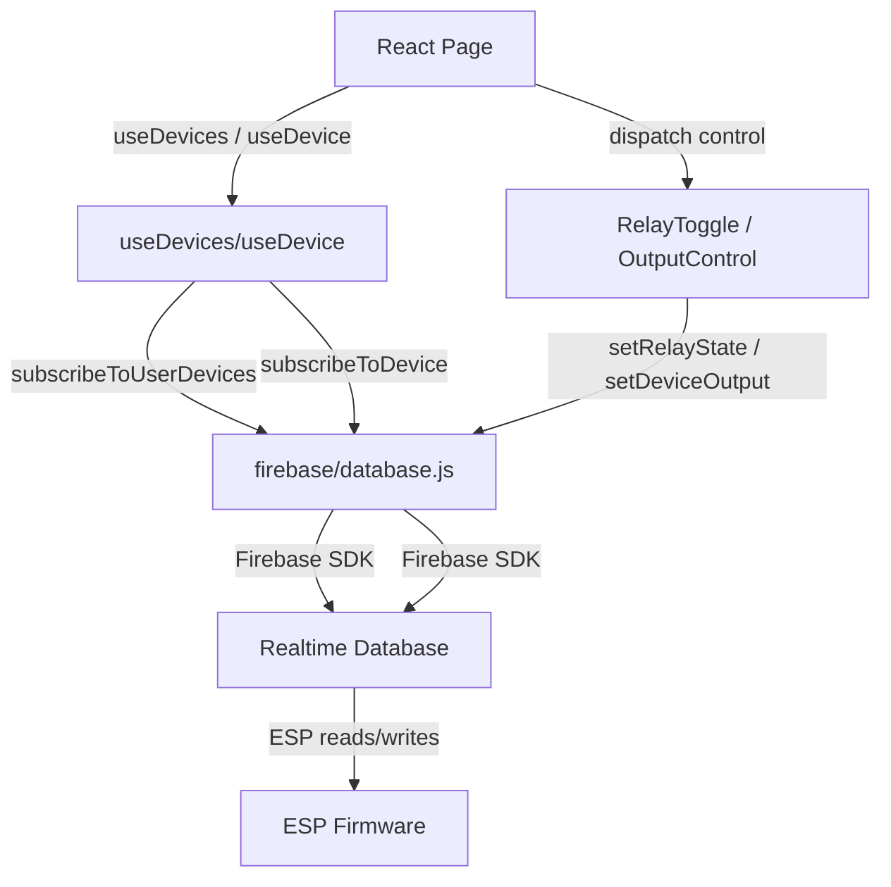

# ESP Dashboard Technical Documentation

## 1. Project Overview

### Purpose of the app
This repository implements a web-based dashboard for managing ESP32/ESP8266 IoT devices using Firebase as the backend. The application is intended to give operators and maintainers a single-pane-of-glass view for device health, relay and output control, sensor telemetry, and history charts.

### Main business logic
The core business logic is:
- Authenticate users via Firebase Email/Password.
- Associate each authenticated user with a set of registered ESP devices stored in Firebase Realtime Database.
- Display live device telemetry and status as delivered by ESP firmware.
- Allow users to toggle relay ports and adjust generic outputs (PWM, stepper, switch) in real time.
- Persist historical sensor logs to support charting and historical review.

### Core features
- `Dashboard` page showing all registered devices and live availability status.
- `DeviceDetail` page for each device with sensor cards, relay toggles, and output controls.
- `History` page with device/date selection and Recharts graphs for temperature, humidity, and motion.
- Device registration and unlinking through `DeviceManager` without deleting device data.
- Authentication and email verification flow via Firebase Auth.
- A one-click bulk shutdown action in `DeviceDetail` to turn off all relays and outputs.
- Demo mode fallback when the authenticated user has no registered devices.

### Target users
- Future developers maintaining or extending the web UI.
- Team members and product owners verifying feature behavior.
- DevOps engineers deploying the SPA and Firebase infrastructure.
- Contributors who need to add new device control types or telemetry charts.
- System maintainers who handle device/user onboarding and support.

## 2. Tech Stack

### Frontend framework
- React 18 with functional components.
- Vite as the build tool and dev server.
- React Router v7 for client-side routing.

### Backend framework
- No custom backend framework is present in this repo.
- The app relies on Firebase services instead of a dedicated server.

### Database
- Firebase Realtime Database.
- Schemaless JSON tree structure optimized for device and user state.

### Authentication system
- Firebase Authentication with Email/Password.
- Email verification is enforced by route guards in `src/App.jsx`.

### State management
- Local React state in components and hooks.
- Shared application state is handled via custom hooks: `src/hooks/useAuth.js`, `src/hooks/useDevices.js`, `src/hooks/useDevice.js`.
- No Redux, MobX, or external state library is used.

### APIs
- Firebase SDK API for Auth and Realtime Database.
- No REST endpoints or backend API server are contained in this repository.
- Data access methods are centralized in `src/firebase/database.js` and `src/firebase/auth.js`.

### Hosting/deployment services
- Static site deployment recommended: Firebase Hosting, Netlify, Vercel, Cloudflare Pages, or any S3-compatible host.
- The app builds to a static asset bundle via `vite build`.

### External dependencies
- `firebase` — Realtime Database and Authentication.
- `react`, `react-dom` — UI rendering.
- `react-router-dom` — navigation and routing.
- `recharts` — charting for history graphs.
- `@vitejs/plugin-react`, `vite` — build tooling.

## 3. Folder & Architecture Explanation

### Root structure
- `index.html` — entry HTML for Vite.
- `package.json` — dependency and script definitions.
- `vite.config.js` — Vite plugin registration.
- `README.md` — user-facing project summary.
- `TECHNICAL_DOCUMENTATION.md` — this detailed documentation.
- `ESP32_Firmware/ESP32_Firebase_Device.ino` — firmware reference for ESP device integration.

### `src/` directory
- `src/main.jsx` — application bootstrap; mounts `<App />` and runs a Firebase connectivity smoke test.
- `src/App.jsx` — root route definitions and authentication-aware page wrapper.
- `src/index.css` — global styling for the application.

### `src/firebase/`
- `src/firebase/config.js` — Firebase initialization and exports.
- `src/firebase/auth.js` — all Firebase Authentication actions.
- `src/firebase/database.js` — all Realtime Database read/write operations.

### `src/hooks/`
- `src/hooks/useAuth.js` — subscribes to Firebase auth state and exposes `user` and `loading`.
- `src/hooks/useDevices.js` — subscribes to the current user’s registered devices.
- `src/hooks/useDevice.js` — subscribes to a single device’s live data.

### `src/pages/`
Contains page-level route views:
- `Dashboard.jsx` — device list and live summary.
- `DeviceDetail.jsx` — detail view with relay/output controls.
- `History.jsx` — historical sensor charts.
- `DeviceManager.jsx` — register/remove devices.
- `Login.jsx`, `Signup.jsx`, `VerifyEmail.jsx`, `Profile.jsx`, `About.jsx` — auth and help flows.

### `src/components/`
Reusable UI components:
- `Layout.jsx` — authenticated shell and sidebar navigation.
- `DeviceCard.jsx` — dashboard device preview card.
- `RelayToggle.jsx` — relay on/off control.
- `OutputControl.jsx` — generic PWM/stepper/switch output widget.
- `StatusBadge.jsx` — online/offline indicator.
- `Spinner.jsx`, `EmptyState.jsx` — loading and empty-state UI.

### `src/utils/`
Shared utilities and demo data:
- `helpers.js` — formatting, device state helpers, chart transformation.
- `demoData.js` — fallback device for demo mode.
- `testFirebase.js` — startup connectivity validation.

### Responsibility of each directory
- `firebase/` isolates backend integration and keeps UI components backend-agnostic.
- `hooks/` encapsulate live subscription and auth logic outside of rendering code.
- `pages/` represent route-level screens and page composition.
- `components/` contain reusable presentational widgets.
- `utils/` provide shared pure functions and sample fixtures.

### Data flow
1. User signs in via `src/pages/Login.jsx` or `src/pages/Signup.jsx`.
2. `useAuth()` subscribes to Firebase auth state and updates the authenticated user.
3. `App.jsx` wraps protected routes with `PrivateRoute`, requiring authenticated and verified users.
4. `useDevices()` reads `users/{uid}/devices` and resolves device objects from `devices/{deviceId}`.
5. `Dashboard.jsx` renders a device grid using `DeviceCard.jsx`.
6. `DeviceDetail.jsx` subscribes to the selected device and writes relay/output changes through `src/firebase/database.js`.
7. `History.jsx` loads historical log snapshots using `getDeviceHistory()`.

### Component hierarchy
- `src/main.jsx`
  - `src/App.jsx`
    - `Layout.jsx`
      - `Outlet` → page components
        - `Dashboard.jsx` → `DeviceCard.jsx`
        - `DeviceDetail.jsx` → `RelayToggle.jsx`, `OutputControl.jsx`, `StatusBadge.jsx`
        - `History.jsx` → Recharts components
        - `DeviceManager.jsx`, `Profile.jsx`, etc.

### Separation of concerns
- UI rendering is in `pages/` and `components/`.
- Data access and Firebase API details are centralized in `firebase/`.
- Real-time subscriptions and state are isolated in `hooks/`.
- Presentation utilities and fallback data are isolated in `utils/`.

### Reusable modules
- `src/firebase/database.js` is the single source of truth for device state updates and history reads.
- `src/firebase/auth.js` is the single source of truth for login/signup/logout/resend flows.
- `src/utils/helpers.js` is the reusable formatting and chart transformation library.
- `OutputControl.jsx` is intentionally generic so new output types can be added without touching multiple pages.

## 4. Setup & Installation

### Prerequisites
- Node.js 18+ (tested with Node 20 compatible with Vite 5).
- npm or yarn.
- Firebase project with Authentication and Realtime Database enabled.

### Environment setup
1. Clone the repository.
2. Install dependencies:
   ```bash
   npm install
   ```
3. Configure Firebase credentials.

### Package installation
Run:
```bash
npm install
```

### Environment variables
This repository currently uses hardcoded Firebase credentials in `src/firebase/config.js`.
For a production deployment, replace that file with an env-driven configuration and do not commit secrets.

### Database migration
- There is no migration framework in this project.
- Firebase Realtime Database is schemaless; deploy and evolve the data model by writing new JSON nodes.

### Local development startup
Start the app locally with:
```bash
npm run dev
```
Then open the local Vite URL shown in the terminal.

### Production build
Create a static production bundle with:
```bash
npm run build
```
The output appears in `dist/`.

## 5. Configuration Documentation

### Config files
- `package.json` — defines the app dependencies and npm scripts.
- `vite.config.js` — enables React plugin for Vite.
- `src/firebase/config.js` — initializes Firebase with project credentials.
- `src/firebase/database.js` — exports database operations and in-app API semantics.
- `src/firebase/auth.js` — exports authentication operations.

### Environment variables
This repository does not currently use `.env` variables in code. The recommended production variables are:

- `VITE_FIREBASE_API_KEY`
  - Purpose: Firebase API key for web app initialization.
  - Accepted values: valid Firebase web API key string.
  - Default: none.
  - Security: public API keys are not secret, but exposing them in source control still reduces configurability.

- `VITE_FIREBASE_AUTH_DOMAIN`
  - Purpose: Firebase Auth domain.
  - Accepted values: `YOUR_PROJECT.firebaseapp.com`.
  - Default: none.
  - Security: safe to expose in the client but should not be hardcoded for production.

- `VITE_FIREBASE_DATABASE_URL`
  - Purpose: URL for the Realtime Database instance.
  - Accepted values: Realtime DB endpoint.
  - Default: none.
  - Security: publicly readable but must be paired with secure DB rules.

- `VITE_FIREBASE_PROJECT_ID`
  - Purpose: Firebase project identifier.
  - Accepted values: project ID string.
  - Default: none.

- `VITE_FIREBASE_STORAGE_BUCKET`, `VITE_FIREBASE_MESSAGING_SENDER_ID`, `VITE_FIREBASE_APP_ID`, `VITE_FIREBASE_MEASUREMENT_ID`
  - Purpose: optional Firebase configuration values for future feature expansion.
  - Accepted values: respective Firebase strings.
  - Default: none.

### API keys
- `apiKey` in `src/firebase/config.js` is required by the Firebase SDK.
- The Firebase API key is not secret but should be environment-configured and not hardcoded in source control on shared branches.

### Feature flags
- No feature flag system exists in the current codebase.
- Suggested extension point: `src/utils/featureFlags.js` or a runtime configuration object consumed by pages.

### Build configuration
- `vite.config.js` currently only includes the React plugin.
- Vite is configured for standard static SPA behavior.
- Production output is generated under `dist/`.

### Deployment configs
- No Dockerfile or CI config exists in the repo.
- Deployment is currently manual via static hosting.

## 6. API Documentation

### Application API surface
The repository does not include a custom REST backend. The app communicates directly with Firebase via SDK calls implemented in `src/firebase/database.js` and `src/firebase/auth.js`.

### Firebase Auth API functions

#### `signupUser(email, password, displayName)`
- File: `src/firebase/auth.js`
- Purpose: create a new user account and send a verification email.
- Operation: Firebase Auth `createUserWithEmailAndPassword`, `updateProfile`, `sendEmailVerification`.
- Request body: `email`, `password`, `displayName`.
- Response: Firebase `User` object.
- Requirements: unauthenticated user.
- Error handling: rethrows Firebase errors; UI handles email in use, invalid email, and weak password.

#### `loginUser(email, password)`
- File: `src/firebase/auth.js`
- Purpose: authenticate existing users.
- Operation: Firebase Auth `signInWithEmailAndPassword`.
- Request body: `email`, `password`.
- Response: Firebase `User` object.
- Requirements: user account must exist.
- Error handling: UI shows invalid email/password message.

#### `logoutUser()`
- File: `src/firebase/auth.js`
- Purpose: sign the user out.
- Operation: Firebase Auth `signOut`.
- Response: none.
- Requirements: authenticated user.

#### `resendVerificationEmail()`
- File: `src/firebase/auth.js`
- Purpose: resend the Firebase verification email.
- Operation: Firebase Auth `sendEmailVerification`.
- Requirements: authenticated user.

#### `reloadCurrentUser()`
- File: `src/firebase/auth.js`
- Purpose: refresh the current user's auth state.
- Operation: Firebase Auth `reload`.

### Firebase Database API functions

#### `subscribeToUserDevices(uid, callback)`
- File: `src/firebase/database.js`
- Route: `/users/{uid}/devices`
- Method: read/listen.
- Request: `uid` string.
- Response: list of device IDs, then device metadata from `/devices/{deviceId}`.
- Authentication: Firebase auth token must be valid.
- Error handling: returns an empty array when no device links exist.
- Rate limits: inherits Firebase Realtime Database listener quota.

#### `getDevice(deviceId)`
- File: `src/firebase/database.js`
- Route: `/devices/{deviceId}`
- Method: read.
- Response: device object or `null`.
- Authentication: enforced by Firebase security rules.

#### `subscribeToDevice(deviceId, callback)`
- File: `src/firebase/database.js`
- Route: `/devices/{deviceId}`
- Method: live listener.
- Response: subscription object with device state.

#### `registerDevice(uid, deviceId, deviceInfo)`
- File: `src/firebase/database.js`
- Route: `/devices/{deviceId}/info` and `/users/{uid}/devices/{deviceId}`
- Method: write/update.
- Payload: `deviceInfo = { name, type, board, location }`.
- Response: none.
- Notes: also sets owner metadata and `registered_at` timestamp.

#### `unregisterDevice(uid, deviceId)`
- File: `src/firebase/database.js`
- Route: `/users/{uid}/devices/{deviceId}`
- Method: delete (set null).
- Response: none.
- Notes: does not delete the device node under `/devices`.

#### `setRelayState(deviceId, relayId, state)`
- File: `src/firebase/database.js`
- Route: `/devices/{deviceId}/relays/{relayId}`
- Payload: `{ state, updated_at, updated_by }`.
- Purpose: toggle relay state for the ESP.

#### `setDeviceOutput(deviceId, outputId, outputData)`
- File: `src/firebase/database.js`
- Route: `/devices/{deviceId}/outputs/{outputId}`
- Purpose: set generic output controls such as PWM, range, stepper, or custom outputs.

#### `turnOffDevicePorts(deviceId, relays = {}, outputs = {})`
- File: `src/firebase/database.js`
- Route: bulk updates under `/devices/{deviceId}/relays/*` and `/devices/{deviceId}/outputs/*`.
- Purpose: safe shutdown of all relays and outputs.
- Logic: switch outputs to safe values based on type.

#### `getDeviceHistory(deviceId, date)`
- File: `src/firebase/database.js`
- Route: `/history/{deviceId}/{date}`
- Response: flattened array of logs sorted by timestamp.

#### `subscribeToRecentHistory(deviceId, limit, callback)`
- File: `src/firebase/database.js`
- Route: `/history/{deviceId}` with query `limitToLast(limit)`.
- Purpose: live recent logs view.

#### `subscribeToNotifications(uid, callback)`
- File: `src/firebase/database.js`
- Route: `/notifications/{uid}`
- Purpose: live user notifications stream.

#### `markNotificationRead(uid, notifId)`
- File: `src/firebase/database.js`
- Route: `/notifications/{uid}/{notifId}`
- Purpose: mark notification as read.

#### `updateAlertConfig(deviceId, alertConfig)`
- File: `src/firebase/database.js`
- Route: `/devices/{deviceId}/alerts`
- Purpose: update alert threshold config.

### Rate limits
- No application-level rate limiting is implemented in this repo.
- Firebase Realtime Database and Auth use Firebase quota limits by default.
- For production, add backend rate limiting or Firebase security rules to prevent abuse.

## 7. Database Documentation

### Schema
The app uses a schemaless Firebase Realtime Database with the following top-level structure:

- `users/{uid}/devices/{deviceId}: true`
- `devices/{deviceId}/info`
- `devices/{deviceId}/status`
- `devices/{deviceId}/sensors`
- `devices/{deviceId}/relays/{relayId}`
- `devices/{deviceId}/outputs/{outputId}`
- `history/{deviceId}/{YYYY-MM-DD}/{logId}`
- `notifications/{uid}/{notifId}`

### Node details
- `devices/{deviceId}/info`
  - `name`, `type`, `board`, `location`, `owner_uid`, `registered_at`
- `devices/{deviceId}/status`
  - `online`, `last_seen`, `ip_address`, `wifi_strength`, `firmware_version`
- `devices/{deviceId}/sensors`
  - `updated_at`, `temperature`, `humidity`, `motion`, `door`, etc.
- `devices/{deviceId}/relays/{relayId}`
  - `state`, `updated_at`, `updated_by`
- `devices/{deviceId}/outputs/{outputId}`
  - `type`, `state`, `value`, `position`, `min`, `max`, `step`, `unit`, `updated_at`
- `history/{deviceId}/{date}/{logId}`
  - `timestamp`, `temperature`, `humidity`, `motion`, etc.
- `notifications/{uid}/{notifId}`
  - `timestamp`, `title`, `message`, `read`

### Table relationships
- `users/{uid}/devices` links authenticated users to device IDs.
- Each device is owned by exactly one user as recorded in `devices/{deviceId}/info.owner_uid`.
- Historical logs are stored per device and partitioned by date for easier reads.

### Indexes
- This repository does not declare explicit Firebase Realtime Database indexes.
- Common query patterns:
  - `orderByChild` and `limitToLast` on `history/{deviceId}` in `subscribeToRecentHistory()`.
- For larger datasets, add Firebase Database rules and indexes under the Realtime Database console.

### Migrations
- No migration or schema versioning system exists.
- Evolve the data structure carefully by writing compatibility checks in `src/firebase/database.js` and Firebase security rules.

### ORM structure
- No ORM is used.
- Data access is performed through Firebase SDK functions.
- `src/firebase/database.js` acts as the data access layer.

### Data lifecycle
1. Device registration via `registerDevice()` stores metadata under `/devices/{deviceId}/info` and links the device for the user.
2. ESP firmware updates `/devices/{deviceId}/status`, `/devices/{deviceId}/sensors`, `/devices/{deviceId}/relays`, and `/devices/{deviceId}/outputs`.
3. User actions from the dashboard write control commands back to `/devices/{deviceId}/relays/*` and `/devices/{deviceId}/outputs/*`.
4. Historical sensor readings are saved under `/history/{deviceId}/{YYYY-MM-DD}/{logId}` for charting.
5. Notification state is stored under `/notifications/{uid}/`.

## 8. Authentication & Security

### Auth flow
- Sign up via `src/pages/Signup.jsx`.
- Firebase creates the user, sets display name, and sends a verification email.
- Login via `src/pages/Login.jsx`.
- `src/App.jsx` `PrivateRoute` enforces both authentication and `user.emailVerified`.
- Verified users can access `Dashboard`, `DeviceDetail`, `History`, `DeviceManager`, `Profile`, and `About`.

### Token handling
- Token management is delegated to Firebase SDK.
- The app does not generate or store custom JWTs.
- `useAuth()` receives updates from `onAuthStateChanged()`.

### Permissions
- The only client-side permission guard is `PrivateRoute` in `src/App.jsx`.
- Real security must be enforced by Firebase Database rules in the Firebase console.
- Example required rule: prevent unauthenticated access to `/users/{uid}` and device nodes.

### Middleware
- There is no server-side middleware in this repository.
- Client-side middleware is effectively route guarding in `App.jsx`.

### Security risks
- `src/firebase/config.js` includes a committed Firebase config object.
  - Risk: lacks environment-specific separation and reduces ability to rotate credentials.
- No Firebase security rules are included.
  - Risk: the database may be readable/writable by unauthorized clients if rules are not configured.
- Client-side validation is present, but server-side input validation must be enforced through Firebase rules.
- No CSRF, request throttling, or abuse prevention is implemented.

### Validation strategy
- Form validation in `Signup.jsx` ensures username presence, password length, and matching passwords.
- Login validation is minimal and error-driven.
- Control inputs in `OutputControl.jsx` clamp values to `min`/`max` ranges.
- For production, add explicit schema validation to Firebase rules and potentially Cloud Functions.

## 9. Deployment Guide

### Production deployment
- Build static assets with `npm run build`.
- Serve the resulting `dist/` folder from static hosting.
- Recommended hosts: Firebase Hosting, Netlify, Vercel, Cloudflare Pages.
- Ensure `src/firebase/config.js` is replaced with environment-driven config in production deployments.

### CI/CD
- Add a CI workflow that runs:
  - `npm install`
  - `npm run build`
  - optional lint/test steps.
- A typical flow for GitHub Actions is:
  - checkout code
  - install dependencies
  - build the app
  - deploy `dist/` to the target host.

### Docker setup
This repo does not include a Dockerfile today. A minimal Docker pipeline would be:
1. Build stage: `node:20-alpine`, `npm ci`, `npm run build`.
2. Serve stage: `nginx:stable-alpine` or another static web server.

Example Docker considerations:
- Copy `dist/` from build stage.
- Serve with gzip compression enabled.
- Do NOT bake Firebase secrets into the image.

### Hosting requirements
- Static SPA hosting for the generated Vite bundle.
- HTTPS required for Firebase Auth.
- Environment configuration for Firebase credentials.
- Optional: SPA rewrite rules to route all paths to `index.html`.

### Scaling considerations
- The frontend is static and scales with the hosting provider.
- Firebase scales automatically for Realtime Database, but watch for:
  - too many open listeners per user.
  - large `history` node reads.
- For larger deployments, segment history data and limit live subscription scope.

### Monitoring/logging
- Browser console logs are the current runtime feedback mechanism.
- `src/utils/testFirebase.js` provides startup connectivity diagnostics.
- Recommended additions:
  - front-end error reporting (Sentry, LogRocket)
  - Firebase usage monitoring in console
  - structured logging around device updates and auth failures.

## 10. Debugging & Troubleshooting

### Common issues
- `Device not found.` on `DeviceDetail.jsx`: the `deviceId` route param is missing or `devices/{deviceId}` is absent.
- `Checking account status...` stuck: `useAuth()` may not receive auth state due to Firebase initialization failure.
- `No devices yet` fallback: user has no registered devices in `/users/{uid}/devices` and demo mode is enabled.
- Email verification redirect: if `user.emailVerified` remains false after verification, call `reloadCurrentUser()` from `Profile.jsx` or `VerifyEmail.jsx`.
- Relay toggles not working: ensure the ESP firmware is listening to `/devices/{deviceId}/relays/*`.

### Known gaps
- There is no server-side enforcement of Firebase rules in the repo.
- No automated tests are included.
- No CI/CD configuration or Dockerfile currently exists.

### Debugging workflow
1. Check browser console for Firebase errors.
2. Confirm `src/firebase/config.js` is correct for the Firebase project.
3. Inspect the Realtime Database structure in the Firebase console.
4. Validate that `users/{uid}/devices` contains the expected device IDs.
5. Use `testFirebaseConnection()` startup output for auth and database connectivity.

### Logging strategy
- UI logs are limited to console output.
- The only explicit runtime test is in `src/main.jsx`.
- For maintainability, add centralized log wrappers and error boundary components.

### Performance bottlenecks
- Live listeners for multiple devices may become heavy with many registered devices.
- Loading full history for a date can be slow if the `history` node contains dense logs.
- `subscribeToUserDevices()` performs one `getDevice()` call per device ID; this can be optimized with batched reads or by denormalizing device snapshots under `/users/{uid}/devices`.

## 11. Code Standards

### Naming conventions
- React components use `PascalCase`.
- hooks use `camelCase` with `use` prefix, e.g. `useAuth`, `useDevices`.
- functions and variables use `camelCase`.
- file names mirror exported component names.

### Architecture rules
- Keep Firebase API logic out of UI components.
- Use hooks for subscription logic.
- Page components should orchestrate data and render child components.
- Reusable UI controls belong in `src/components/`.

### Component patterns
- Page-level views in `src/pages/`.
- Presentational controls in `src/components/`.
- Shared formatting helpers in `src/utils/helpers.js`.
- All interactivity should use explicit event handlers and `useState`/`useEffect`.

### Git workflow
- Use feature branches for new functionality.
- Keep `main` stable and deployable.
- Use descriptive commit messages focused on one logical change.

### Branch strategy
- `main` for production-ready builds.
- `feature/<feature-name>` for new pages or device control changes.
- `fix/<issue>` for bug fixes.
- `docs/<topic>` for documentation-only updates.

### Testing standards
- No tests currently exist.
- Recommended baseline coverage:
  - unit tests for `src/utils/helpers.js`
  - integration tests for route guards in `src/App.jsx`
  - snapshot tests for page composition and form behaviors.
- Use Jest + React Testing Library if adding tests.

## 12. Future Development Guide

### Adding new features
- Add new Firebase paths or fields in `src/firebase/database.js`.
- Keep new data access methods centralized.
- Add page routes in `src/App.jsx` and corresponding files in `src/pages/`.

### Adding pages/components/modules
- New pages: add under `src/pages/` and import into `src/App.jsx`.
- New reusable UI widgets: add under `src/components/`.
- New data subscriptions: encapsulate in `src/hooks/`.
- New business logic should not be placed directly in JSX markup.

### Extension points
- `OutputControl.jsx` is the primary extension point for new device output types.
- `src/firebase/database.js` is the extension point for new device command semantics.
- `src/utils/helpers.js` is the extension point for new telemetry formatting and chart preparation.

### Technical debt
- Hardcoded Firebase credentials in `src/firebase/config.js`.
- Missing Firebase security rules and production deployment configuration.
- No automated tests or CI/CD flow.
- No Dockerfile or containerized build pipeline.

### Scalability limitations
- `subscribeToUserDevices()` is not optimized for hundreds of devices.
- Realtime database structure may require denormalization for high-volume history writes.
- Large `History` queries may need pagination or aggregated views.

### Refactoring priorities
1. Externalize Firebase config to environment variables.
2. Add Firebase security rules and document expected rulesets.
3. Introduce CI/CD build and deployment automation.
4. Create a `Dockerfile` for reproducible builds.
5. Add unit/integration tests for auth and device control flows.

## 13. Diagrams

### System Architecture



### Request lifecycle



### Database relation diagram



### Frontend / Backend interaction


